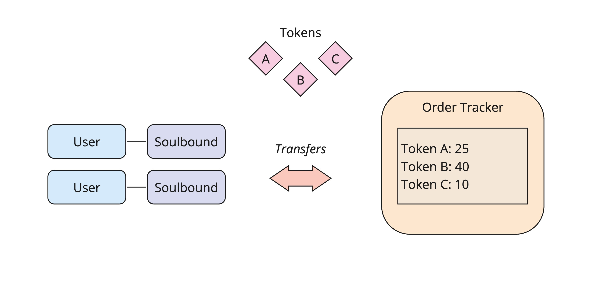

# Order Tracker (Transfer Hook Example)

This program serves as a simple protocol demonstrating how to use Token-2022's
Transfer Hook extension to create a protocol built on top of transfer hooks.

This protocol imposes the following restrictions on transfers:

- The source owner must have a soulbound token.
- The source owner must have a protocol profile.
- The destination owner must have a soulbound token.
- The destination owner must have a protocol profile.

Additionally, the protocol tracks "order volume" on each transfer by simply
recording the number of tokens transferred.

> Note: Don't forget to update the program's ID in `declare_id`!

```
./start
```

```
cargo test-sbf
```


